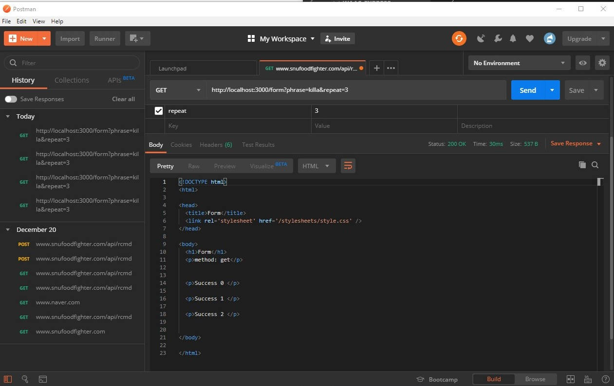
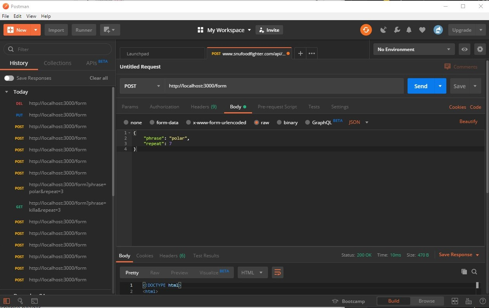
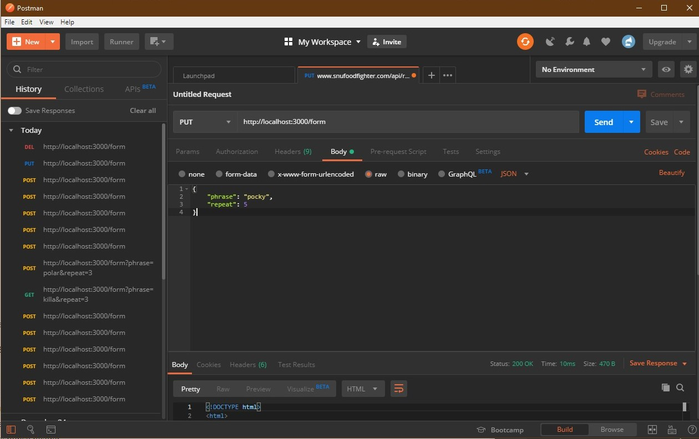
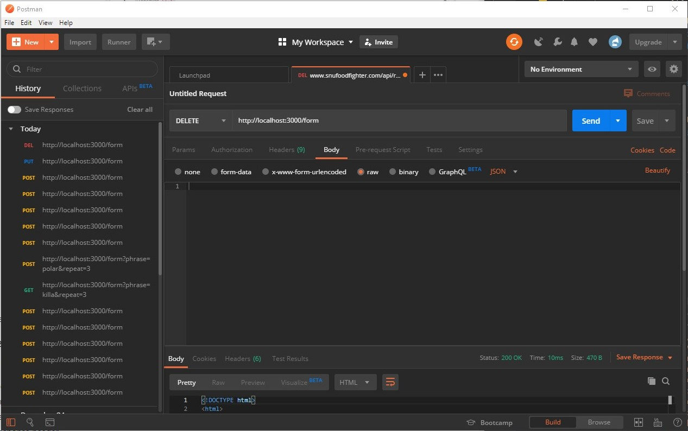
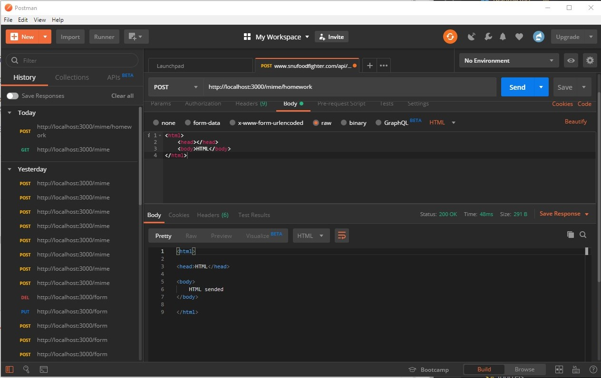
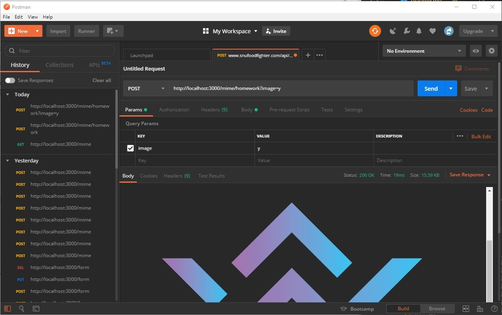
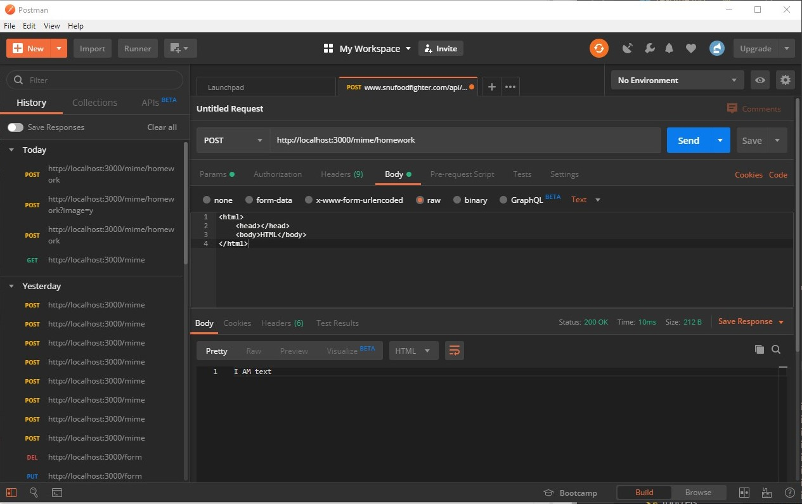
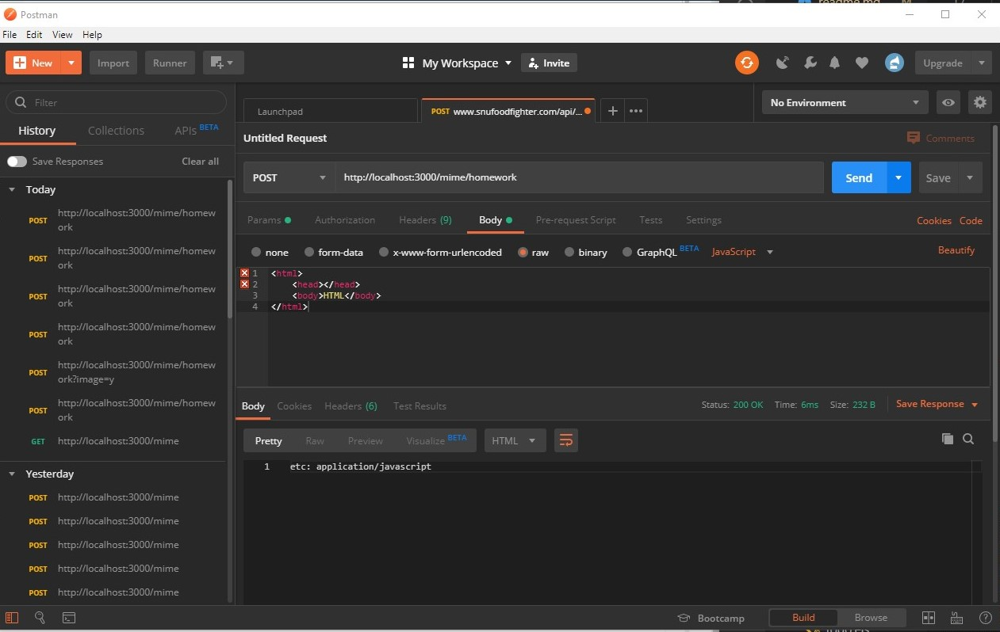
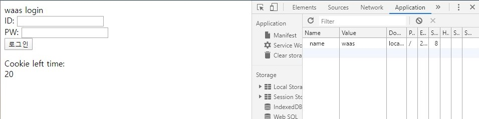
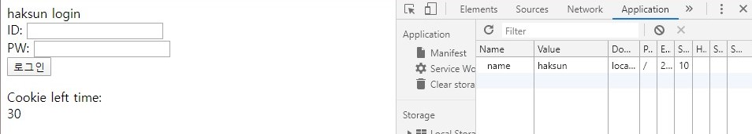

##이학선 haksunlee39 의 과제!
### 12월 23일
* todo list의 제목을 "HelloTODO"로 하기 위해서는 localhost:3000/todo?title=HelloTODO 로 접근해야 함

이 외에도 다양한 것들이 있음!
req.params
req.body 등등...

### 12월 24일

* GET 요청 3번을 하기 위해서는 localhost:3000/form?phrase=killa&repeat=3 을 해야한다


* POST 요청 7번을 하기 위해서는 localhost:3000/form 에 JSON 파일로 
```JSON
{
	"phrase": "polar",
	"repeat": 7
}
```
을 하면 된다


* PUT 요청 5번을 하기 위해서는 위와 비슷하다 localhost:3000/form 에 JSON 파일로
```JSON
{
	"phrase": "pocky",
	"repeat": 5
}
```
을 하면 된다


* DELETE 요청 1번을 하기위해서는 DELETE 명령으로 접속만 해주면 된다.

### 12월 25일
*가능한 경우는 4가지!

* 먼저 text/html 형식으로 보내는 것


* 다음은 text/plain 형식으로 보내고 'image' 라는 KEY 에 y 라는 값을 넣고 보내는 것


* 먼저 text/plain 형식으로 보내는 것


* 위와 겹치지 않는 방법으로 보내는 것


### 12월 26일
* cookie-parser와 cookie 설정법
```javascript
var express = require('express')
var cookieParser = require('cookie-parser')
 
var app = express()
app.use(cookieParser())
 
app.get('/', function (req, res) {
  // Cookies that have not been signed
  console.log('Cookies: ', req.cookies)
 
  // Cookies that have been signed
  console.log('Signed Cookies: ', req.signedCookies)
})
 
app.listen(8080)
```
대충 요런식으로 쓰면 됨
* cookie의 timeout, age
```javascript
if(req.body.id === 'waas' && req.body.pw === 'team') {
    res.cookie('name', 'waas', {
        maxAge: 30000   // 30000밀리초 → 30초
    })
}
```
여기에서 30초 라는 수명을 줌
* chrome 개발자 도구 > applications > cookie에서 cookie가 생긴 것을 확인 (**screenshot 기록해둘 것**)



* login process과 redirect의 response code

코드에 따라 200 또는 302를 발견할 수 있음

* `/login/isLoggin`에서 400, 200 response code 확인

만약 waas 로 로그인 했다면 200 아니라면 401이 뜸

### 12월 27일: login 구현체 수정
```javascript
if(req.body.id === 'haksun' && req.body.pw === 'chocolate') {
    res.cookie('name', 'haksun', {
        maxAge: 30000   // 30000밀리초 → 30초
    })
}
```
이런식으로 아이디가 'haksun' 이고 비밀번호가 'chocolate'인 계정을 만듦.


로그인 한 모습!

```javascript
router.get('/isLogin', function(req, res, next) {
    if(req.cookies.name === undefined) {
        return res.status(401).send("unauthorized");
    }
    else {
        //////////////////////////////////////////////////////
        if(!(req.cookies.name === 'waas')) {
            return res.status(403).send("forbidden");
        }
        //////////////////////////////////////////////////////
        else
        {
            return res.status(200).send("waas team");
        }
    }
})
```
두 주석 사이에 있는 부분을 추가했다. 만약 로그인한 아이디가 waas 가 아닌경우 코드 403과 forbidden을 보내면서 접속을 못하게 해준다.